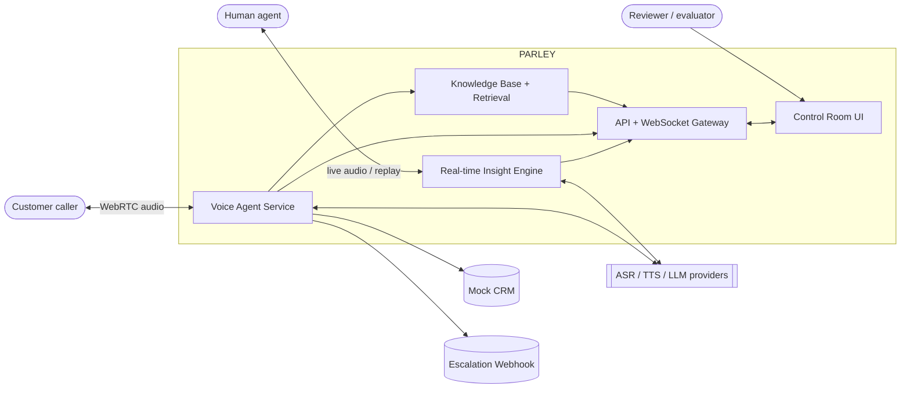
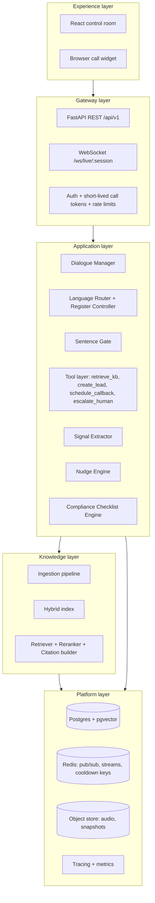
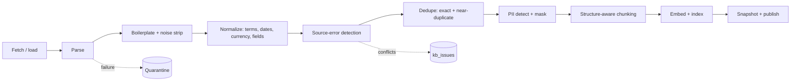
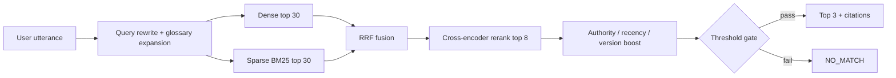
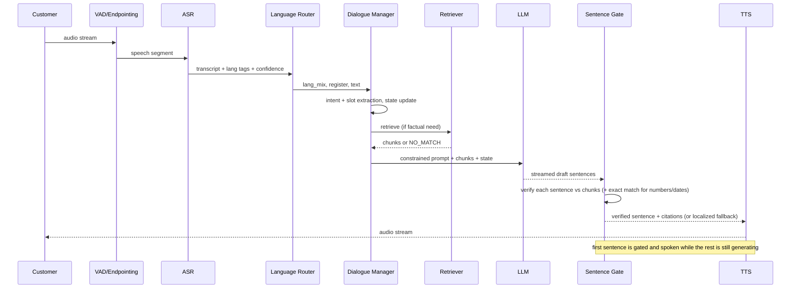
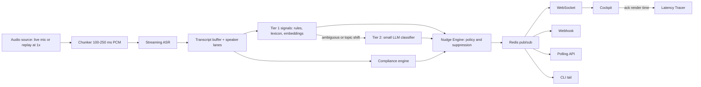
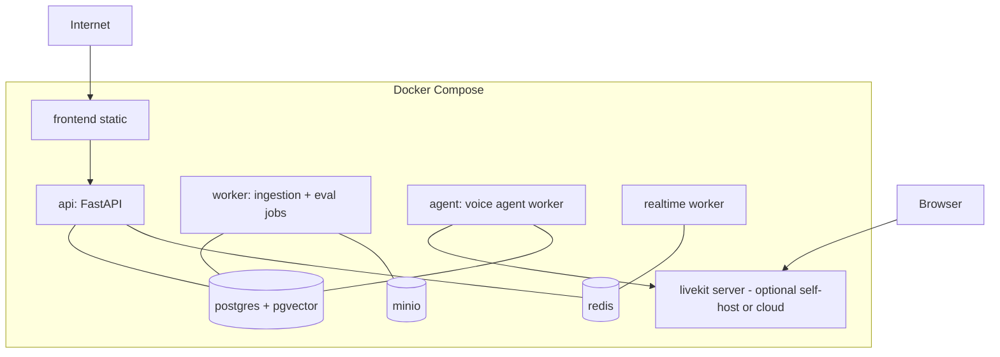

# PARLEY — ARCHITECTURE

> Version 1.0 · Status: design baseline for implementation
> Scope: the four assessment deliverables (grounded voice agent, production-ready knowledge base, native-language PH/ID bots, live call nudges) built as one system.

---

## 1. Purpose and architectural principles

PARLEY is a single platform with three product surfaces that share one core:

| Surface | Assessment question | Core idea |
|---|---|---|
| Knowledge Base (KB) | Q2 | Messy business content becomes traceable, versioned, PII-safe, retrievable records |
| Voice Agent | Q1, Q3 | A real-time conversation engine that speaks only what the KB supports |
| Live Nudge Engine | Q4 | A streaming analyzer that advises a human agent during a call |

### Principles (each one is a design constraint, not a slogan)

1. **Grounding is enforced, not hoped for.** The LLM drafts; a deterministic gate decides what is spoken. Facts reach the model only through retrieval.
2. **Every output has a receipt.** Spoken sentences, nudges, and metrics carry `trace_id` and citation references.
3. **Failure is a designed path.** "I don't have that information" is a tested feature with localized phrasing and a next action (callback or human).
4. **Localization is data.** Markets differ by *Market Pack* configuration, not by forked code.
5. **Measure everything that the assessment asks to be measured.** Latency (P50/P95), retrieval verdicts, nudge false positives, ASR quality.
6. **Suppression is as important as detection.** The nudge engine logs what it chose *not* to say and why.
7. **Reliable core over features.** If time runs out, cut breadth (extra pages, extra accents) before cutting any gate, metric, or fallback.

---

## 2. System context



External dependencies are isolated behind adapter interfaces (`CallProvider`, `ASRProvider`, `TTSProvider`, `LLMClient`, `EmbeddingProvider`, `Reranker`). No business logic imports a vendor SDK directly.

---

## 3. Logical architecture (layers)



---

## 4. Component catalogue

| Component | Responsibility | Inputs | Outputs | Failure behavior |
|---|---|---|---|---|
| **Ingestion pipeline** | Fetch, parse, clean, normalize, dedupe, mask PII, chunk, embed, publish snapshots | Raw HTML/PDF/DOCX/CSV | Versioned records + reports | Quarantine source with reason code; never silently drop |
| **Hybrid index** | Dense + sparse search with metadata filters | Query + filters | Candidate chunks | Falls back to sparse-only if embedding service is down |
| **Retriever** | Query rewrite, hybrid fusion (RRF), rerank, thresholding, citations | User utterance + market + version | Top-k chunks or `NO_MATCH` | Timeout (400 ms budget) → treated as `NO_MATCH` |
| **Language Router** | Per-turn language mix, formality, voice/SSML profile selection | ASR text + ASR language tags | `lang_mix`, `register`, `tts_profile` | Defaults to market primary language |
| **Dialogue Manager** | State machine + LLM turn generation + slot extraction + disposition | Transcript, state, retrieved chunks | Draft response + tool calls | Safe fallback phrase on any error |
| **Sentence Gate** | Verify every factual sentence is supported; strip/replace otherwise | Draft + chunks | Verified sentences with citations | Fail-closed: if verifier unavailable, only non-factual sentences are spoken |
| **Tool layer** | CRM lead, callback scheduling, human escalation | Structured tool calls | Result JSON | Retries then escalates |
| **ASR adapter** | Streaming speech-to-text per market profile | PCM audio | Partial/final transcripts with confidence and latency | Provider failover to secondary |
| **TTS adapter** | Native voice synthesis with SSML | Verified text + profile | Audio stream | Failover voice; text-only caption if all fail |
| **Signal Extractor** | Tier-1 rules/embeddings + Tier-2 small LLM | Rolling transcript window | Typed signals with confidence and span | Tier-2 shed first under load |
| **Compliance Engine** | Required-disclosure checklist with stage timers | Transcript + stage | Compliance signals | Always runs (rules only, no LLM dependency) |
| **Nudge Engine** | Convert signals to nudges and apply suppression policy | Signals + policy | Fired/suppressed nudge records | If it crashes, no nudge is emitted (never emits unvetted nudges) |
| **Latency Tracer** | Monotonic timestamps across stages | Events | Spans, P50/P95/P99 | Non-blocking, sampled logging |
| **API/WS Gateway** | Contracts to UI, replay, evidence export | HTTP/WS | JSON/events | Rate limited; versioned |

---

## 5. Data architecture

### 5.1 Core tables (Postgres)

```
kb_versions(kb_version PK, created_at, parent_version, notes, status[draft|active|archived])
kb_sources(source_id PK, type, uri, section, fetched_at, http_status, content_hash,
           extraction_health, parse_method, status[ok|quarantined|failed], reason_code)
kb_records(record_id PK, kb_version FK, title, content, category, category_path, market, lang,
           audience, source_id FK, version, valid_from, valid_to, supersedes, duplicate_of,
           pii bool, pii_types text[], confidence, content_hash, citation_display)
kb_chunks(chunk_id PK, record_id FK, kb_version FK, chunk_index, heading_path, text,
          token_count, embedding vector(N), tsv tsvector, embedding_model, embedding_version)
kb_issues(issue_id PK, severity, type[conflict|typo|impossible_date|extraction], source_ids[], resolution_policy, resolved bool)
pii_vault(token PK, entity_type, ciphertext, created_at)          -- not readable by retriever role
retrieval_evidence(evidence_id PK, query, market, retrieved_record_ids[], source_refs[], explanation, verdict)
calls(call_id PK, market, scenario, language_mix jsonb, kb_version, audio_uri, started_at, ended_at, outcome jsonb)
turns(turn_id PK, call_id FK, speaker, text, t_start, t_end, asr_conf, lang_tags, trace_id)
bot_sentences(sentence_id PK, turn_id FK, text, status[verified|blocked|fallback], citations text[])
spans(span_id PK, trace_id, parent_span_id, stage, started_at_ms, ended_at_ms, provider, meta jsonb)
signals(signal_id PK, session_id, kind, confidence, span_text, t, tier)
nudges(nudge_id PK, session_id, decision[fired|suppressed], reason, priority, text, topic,
       confidence, expires_at, thresholds jsonb, signal_ids[], trace_id, feedback)
eval_runs(run_id PK, type, config jsonb, metrics jsonb, created_at)
```

Row-level separation: the retriever's DB role has no access to `pii_vault`.

### 5.2 Record identity and traceability

`record_id` = `kb_{category_prefix}_{NNN}` (example: `kb_product_001`). A citation string is always `[record_id@kb_version · source.display]`, for example `[kb_product_001@v1.1 · Website › Branch Partnership]`. The same string is stored on spoken sentences, shown in the UI receipt drawer, and used in evidence tables.

### 5.3 Versioning model

- Snapshots are immutable. A new snapshot is created by pipeline run, never by editing rows in place.
- `supersedes` links connect a changed record to its predecessor.
- Calls store `kb_version`; `POST /replay` re-answers a turn against another version.
- Retrieval regression tests run for each snapshot and results are stored in `eval_runs`.

---

## 6. Knowledge-base pipeline



### 6.1 Extraction and parsing

| Source type | Method | Failure signal |
|---|---|---|
| Static website | HTTP fetch + main-content extractor + DOM structure parsing | Low text density, boilerplate ratio too high |
| JS-rendered page | Headless browser fallback | Empty DOM after render |
| Text PDF | Text + layout extraction; table extraction | Garbled-character ratio |
| Scanned PDF | OCR with per-page confidence | Confidence below threshold → quarantine/flag |
| DOCX | Document-structure parser | Missing styles → heading inference |
| CSV/XLSX | Tabular parser + header validation | Header drift |

`extraction_health` (0–1) combines text density, garble ratio, table integrity, and OCR confidence. Below 0.6 the source is quarantined with a reason code and surfaced in the UI.

### 6.2 Cleaning

- Remove navigation, cookie banners, headers/footers, breadcrumbs, share widgets, repeated disclaimers (cross-document line frequency plus DOM-region heuristics).
- Standardize: heading casing and hierarchy, ISO-8601 dates (original retained), currency/amount formats per market, form field names (snake_case), terminology through `glossary.yaml`.
- Source-error flags: conflicting numeric facts across sources (for example grace period 15 vs 30 days), impossible dates, out-of-range rates, orphan references. Resolution policy by authority: policy wording > official website > marketing material.

### 6.3 Deduplication

1. Exact: normalized-content hash.
2. Near-duplicate: MinHash/LSH shortlist, then embedding cosine confirmation (default threshold 0.92, within category and market).
3. Canonical selection: highest authority, then most recent, then most complete. Others retain `duplicate_of`.

### 6.4 PII protection

Layered detection (regex with checksum validators, NER with custom recognizers, sampled LLM review) → typed tokens (`[PHONE_1]`) → encrypted vault. Records containing PII are flagged `pii=true` and excluded from the voice-agent index. A CI test scans every indexed chunk for residual patterns.

### 6.5 Chunking strategy

| Content | Chunk unit |
|---|---|
| FAQ | One question–answer pair |
| Objection playbook | One objection + approved response pair |
| Qualification rule | One rule with condition and outcome |
| Table | Row group with repeated column headers |
| Prose | 150–350 tokens, structure-aware, 15% overlap |

Every chunk is prefixed with its `heading_path` before embedding (contextual chunk header).

### 6.6 Taxonomy

`product`, `policy_rules`, `qualification_rules`, `faq`, `objection_handling`, `forms_and_fees`, `compliance_disclosures`, `escalation_rules`, `partnership_benefits`, `nudge_playbook`. Each has market overrides (`in`, `ph`, `id`).

---

## 7. Retrieval design



- **Filters:** `market`, `lang`, `category`, `valid_at`, `kb_version`, `pii=false`.
- **Threshold gate:** `min_rerank_score` and `min_margin` between rank 1 and rank 2 when records conflict.
- **`NO_MATCH`:** triggers the unavailable-information path; this is the system's defense against hallucination.
- **Budget:** 120 ms typical, 400 ms hard timeout inside a live call.
- **Same code path** serves the Retrieval Lab API and the voice agent's `retrieve_kb` tool, so the KB-to-bot connection is real and demonstrable.

---

## 8. Voice agent architecture

### 8.1 Turn pipeline



### 8.2 Dialogue state machine

`GREET_VERIFY → PURPOSE → STATUS_CHECK → QUALIFY → HANDLE_OBJECTION → COMMIT → CLOSE`

Cross-cutting handlers (can preempt any state): `UNSUPPORTED_QUESTION`, `OUT_OF_SCOPE`, `CONFLICTING_DETAILS`, `HUMAN_ESCALATION`, `DISTRESS_OR_VULNERABLE`.

- **LLM role:** understand, extract slots, phrase responses.
- **Code role:** transitions, qualification scoring, eligibility flags, disposition (`will_pay`, `needs_callback`, `needs_human`, `not_interested`, `dispute`), escalation triggers.
- Qualification rules live in YAML and are unit-tested, so outcomes are deterministic and explainable.

### 8.3 Sentence Gate (key mechanism)

1. Segment the draft into sentences and classify each: `factual` (needs support) or `conversational` (greetings, confirmations, questions).
2. For `factual` sentences: (a) exact-match check for numbers, dates, amounts, durations, percentages against chunk text; (b) entailment check (small LLM or cross-encoder) that a retrieved chunk supports the claim.
3. Outcomes: `verified` (spoken with citation), `blocked` (dropped), `fallback` (replaced by the localized unavailable-information phrase plus offer of callback/human).
4. **Fail-closed:** if the verifier is unavailable or times out, factual sentences are not spoken.
5. Every outcome is persisted in `bot_sentences`, including blocked drafts (for review and the UI's gate strip).

### 8.4 Escalation triggers

Explicit request for a human; two consecutive fallbacks; frustration score above threshold; complaint/legal/regulator keywords; vulnerable-customer cues; repeated misunderstanding. Action: `escalate_human` tool → webhook with summary, reason, transcript link, spoken handoff line in the customer's language.

### 8.5 Tools

| Tool | Purpose | Result |
|---|---|---|
| `retrieve_kb` | Grounded facts | chunks + citations or `NO_MATCH` |
| `create_lead_or_update_crm` | Mock CRM record and summary | CRM id |
| `schedule_callback` | Parse and book callback slot (timezone-aware) | slot confirmation |
| `escalate_human` | Webhook handoff | delivery status |

---

## 9. Market Packs and multilingual design

```
market_packs/{in_en|ph_tl|id_id}/
  pack.yaml            # languages, ASR/TTS profile, thresholds
  persona.md           # tone, honorifics, politeness rules
  flow.yaml            # state-machine overrides, qualification rules
  glossary.yaml        # canonical terms, do-not-translate list, pronunciation overrides
  fallbacks.yaml       # unavailable-info, escalation, silence, misunderstanding phrases
  disclosures.yaml     # required disclosures with stage gates (for compliance engine)
  formats.yaml         # date, amount, number reading rules for SSML
```

### 9.1 Language Router and Language Lock

- Inputs: ASR language tag(s), a lightweight lexical classifier, previous-turn state.
- Outputs per turn: `lang_mix` (for example `{en: 0.22, tl: 0.61, bridge: 0.17}`), `formality` (formal ↔ colloquial), TTS voice and SSML profile.
- **Language Lock:** fallback, escalation, and clarification strings are drawn from the pack in the active language/register. A drift detector computes the English-token ratio of each bot turn; if above the pack threshold while the customer is not code-switching, the turn is flagged (and in CI, fails).

### 9.2 Market specifics

| Market | Languages | Sector flow | Notable adaptation |
|---|---|---|---|
| `in_en` | English (Hinglish-tolerant understanding) | Insurance renewal | Grace period / lapse / revival wording, polite formal English |
| `ph_tl` | English, Filipino, Taglish | Life insurance premium/renewal, bancassurance referral follow-up | "po/opo", sir/ma'am, bank/GCash/over-the-counter payment, softeners |
| `id_id` | Formal and colloquial Bahasa, English loanwords, regional accent test | Multifinance instalment reminder | Bapak/Ibu/Kak, cicilan/angsuran/denda/tenor/DP/jatuh tempo, payday timing, virtual account/minimarket |

### 9.3 ASR and TTS configuration strategy

- Each pack declares its ASR provider, model, language hints, and phrase-boost list. At least two providers are benchmarked per market; the choice and measured trade-offs are documented.
- Regional accent: a Javanese-accented Indonesian test set (self-recorded or consented, documented honestly) is compared with standard Jakarta speech.
- TTS: native Filipino and Indonesian voices where available; SSML for numbers, dates, amounts, pacing; pronunciation overrides for English loanwords; every compromise documented.
- Provider availability changes frequently. The architecture treats it as a configuration and measurement concern, never a hard-coded assumption.

---

## 10. Real-time insight (Q4) architecture



### 10.1 Signals

| Signal | Tier | Example trigger |
|---|---|---|
| Missed cross-sell | 1 (+2 on ambiguity) | "my wife also has a car", "second bike" |
| Compliance gap | 1 (rules) | Agent moves to payment/commitment before required disclosure |
| Risky statement | 1 (+2) | "guaranteed returns", "no need to read terms" |
| Rising frustration | 1 | Negative sentiment slope, interruptions, repeated complaint terms |
| Payment difficulty | 1 | "can't pay this month", "tanggal gajian", "wala pa pong sahod" |
| Buying signal | 1 (+2) | Questions about price, benefits, start date |
| Callback need | 1 | "call me later", "busy now" |
| Intent/topic shift | 2 | Embedding drift across windows |

### 10.2 Nudge policy ("Nudge Court")

| Control | Behavior |
|---|---|
| Confidence threshold | Per-signal-type; raised automatically when audio quality is poor |
| Duplicate suppression | Semantic similarity plus same-topic id within window |
| Cooldown | Per topic (default 20 s; compliance reminders re-fire only after N seconds if still unmet) |
| Topic grouping | Related signals merged into one nudge |
| Priority | P0 compliance > P1 frustration/payment > P2 opportunity > P3 coaching |
| Expiry | Opportunity nudges expire after N seconds or on topic change; compliance nudges persist until acknowledged or satisfied |
| Rate limit | Maximum nudges per minute |
| Noisy-audio guard | Requires corroboration by two signals when ASR confidence or SNR is low |

Every decision persists `{decision, reason, thresholds_at_time, signal_ids, trace_id}`. Approved nudge wording comes from the `nudge_playbook` KB category; the LLM may only shorten/personalize to ≤ 18 words, and compliance nudges use exact approved text.

### 10.3 Latency measurement

Timestamps (monotonic, per stream): `audio_chunk_received → asr_partial → asr_final → signal_detected → llm_start → llm_end → nudge_created → nudge_sent → ui_rendered`.

| Metric | Definition | Target (P95) |
|---|---|---|
| ASR latency | chunk received → final text | ≤ 700 ms |
| Signal extraction (Tier 1) | text → signal | ≤ 50 ms |
| LLM (Tier 2) | request → response | ≤ 900 ms |
| Delivery | nudge_sent → ui_rendered | ≤ 150 ms |
| End to end, Tier 1 | received → rendered | ≤ 2.5 s |
| End to end, with LLM | received → rendered | ≤ 3.5 s |

Targets are engineering goals; the reported numbers must be the measured ones.

---

## 11. Latency budget for live voice turns (Q1/Q3)

| Stage | Budget (median) |
|---|---|
| End-of-speech detection | ~250 ms |
| ASR finalization | ~150 ms |
| Retrieval | ≤ 120 ms |
| LLM first token (streamed) | ≤ 450 ms |
| Sentence Gate (first sentence) | ≤ 150 ms |
| TTS first byte | ≤ 250 ms |
| **User stops → bot audio starts** | **≤ ~1.2 s** |

Techniques: sentence-level pipelining (gate and speak sentence 1 while sentence 2 generates), warm provider connections, embedding cache for frequent queries, retrieval skip for purely conversational turns, barge-in cancellation of in-flight TTS.

---

## 12. API and event contracts

Base path `/api/v1`. All responses include `trace_id`. TypeScript types are generated from the OpenAPI schema.

**REST:** `GET /kb/records`, `GET /kb/records/{id}`, `GET /kb/versions`, `GET /kb/versions/{v}/diff`, `POST /retrieval/search`, `GET|PUT /retrieval/evidence`, `POST /calls/token`, `GET /calls`, `GET /calls/{id}`, `GET /trace/{trace_id}`, `POST /replay`, `GET /eval/summary`, `GET /asr/bench`, `POST /live/sessions`, `GET /live/{id}/nudges`.

**WebSocket `/ws/live/{session_id}` events:**

```
transcript.partial   {speaker, text, t}
transcript.final     {speaker, text, t_start, t_end, asr_latency_ms}
signal               {kind, confidence, span, t}
nudge.fired          {id, priority, text, reason, confidence, expires_at, topic}
nudge.suppressed     {id, reason, details}
latency.sample       {stage, ms}
call.state           {state}
register.update      {lang_mix, formality}
gate.event           {turn_id, status, draft, final, citations}
```

---

## 13. Deployment architecture



Environment is configured only through `.env` (template `.env.example`). Secrets are never committed; a secret-scanning pre-commit hook is required.

---

## 14. Security, privacy, compliance

- Synthetic customer data only. Real personal data never enters the repository.
- PII vault encrypted and isolated by DB role; logs scrub PII; audio retention policy and recording-consent line present in every script.
- Prompt-injection defense: KB text and customer utterances are wrapped as untrusted data; tool allow-list; instruction patterns stripped from KB content at ingestion; gate rejects claims not supported by retrieved evidence.
- Authentication on API; short-lived call tokens; rate limiting.
- Regulatory-wording register: disclosures for each market flagged as "requires legal review." The system makes no claim of legal compliance.

---

## 15. Failure modes and designed responses

| Failure | Detection | Response |
|---|---|---|
| ASR provider outage | Error/timeouts | Failover to secondary; if both fail, apologize and offer callback |
| Low ASR confidence | Confidence < threshold | Ask to repeat (in language); repeat-count feeds escalation |
| Retrieval timeout | > 400 ms | Treat as `NO_MATCH`, fallback phrase |
| LLM timeout | > budget | Short localized hold phrase, retry once, then escalate |
| Verifier unavailable | Error | Fail-closed: no factual sentences spoken |
| TTS outage | Error | Backup voice; text caption; offer callback |
| Language drift | Drift detector | Regenerate with locked language; log metric |
| Conflicting customer details | Slot conflict | Read-back confirmation; single clarifying question |
| Nudge flood | Rate/duplicate counters | Group and throttle; raise thresholds |
| Noisy audio | SNR/ASR confidence | Noisy-audio guard raises thresholds |
| WebSocket drop | Heartbeat | Client reconnect with backoff; poll API for missed nudges |

---

## 16. Scaling and noisy-audio limitations (10x discussion)

- **Concurrency:** one worker process per N streams; bounded queues with backpressure; Tier-2 LLM calls shed first; Tier-1 and compliance always run.
- **ASR cost/latency:** streaming connections are the main cost driver; consider regional deployment and provider-side autoscaling.
- **Redis fan-out:** shard by `session_id`; limit WebSocket subscribers per session.
- **Retrieval:** HNSW tuning, read replicas, cache for frequent queries; move to a dedicated vector store if the corpus grows beyond Postgres comfort.
- **Noisy audio:** diarization drift, language flips, hallucinated tokens in ASR, reduced sentiment accuracy. Mitigations: stereo channel separation, phrase boosting, confidence-weighted signals, corroboration rule, and conservative defaults.
- **Known limits:** small labeled evaluation sets give wide confidence intervals; accent coverage is limited; native-speaker and compliance review are outstanding items.

---

## 17. Observability and evaluation

- Traces: `trace_id` propagated across ASR, retrieval, LLM, gate, TTS, delivery; stored as `spans`.
- Metrics: grounded-sentence rate, unsupported-blocked count, refusal reasons, recall@k, MRR, nudge precision/FP rate, language-drift rate, P50/P95/P99 per stage.
- Evaluations (stored in `eval_runs`): retrieval regression, red-team prompts (fabrication, injection, PII requests), dialogue disposition accuracy, chaos matrix (SNR × accent × code-switch).

---

## 18. Key design decisions (summary)

| Decision | Chosen | Rejected | Reason |
|---|---|---|---|
| Voice platform | LiveKit Agents behind `CallProvider` | Fully managed no-code only | Pipeline control for gate, tracing, and latency measurement |
| Vector store | Postgres + pgvector | Separate vector DB | Single store for records, versions, and traces; simpler to run in 48 h |
| Retrieval | Hybrid + rerank + threshold | Dense-only | Better handling of numbers, product names, mixed language |
| Grounding | Post-generation Sentence Gate | Prompt-only "don't hallucinate" | Deterministic guarantee and auditable evidence |
| Localization | Market Packs | Language-forked prompts | Maintainability and clear evidence of adaptation |
| Nudges | Tiered signals + suppression policy | LLM-on-every-window | Latency, cost, false-positive control |
| Backend language | Python/FastAPI | Node | AI/NLP ecosystem and async streaming support |
