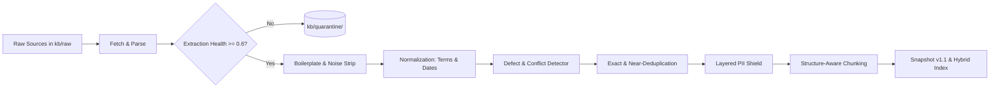

# PARLEY — KNOWLEDGE BASE ARCHITECTURE & DESIGN (Q2)

> Comprehensive documentation of the 9-stage knowledge-base engineering pipeline, deliberate planted-defect detection results, deduplication clusters, PII vault isolation, and hybrid retrieval performance.

---

## 1. Pipeline Architecture Overview

The PARLEY Knowledge Base pipeline transforms messy, heterogeneous business documents (HTML, Markdown, CSV, OCR text) into immutable, versioned, PII-safe, retrievable records.

### The 9 Processing Stages
1. **Fetch & Parse (`fetch_parse.py`):** Ingests HTML via BeautifulSoup, Markdown headers, CSV tabular schemas, and OCR text buffers. Computes per-source `extraction_health` score.
2. **Extraction Health & Quarantine:** Scores character entropy, printable character ratios, and garble sequences. Any source with `extraction_health < 0.60` is immediately quarantined to `kb/quarantine/` with reason code `LOW_HEALTH_OCR_GARBLE` and excluded from indexing.
3. **Boilerplate Stripper (`cleaner.py`):** Removes cookie banners, navigation links, header menus, social blocks, and copyright footers. Employs a cross-document line frequency tracker to collapse repeated statutory notices (e.g. repeated IRDAI notices) into a single canonical occurrence.
4. **Normalizer (`normalizer.py`):** Canonicalizes financial terminology via `glossary.yaml` across markets (`in_en`, `ph_tl`, `id_id`). Normalizes heterogeneous dates (DD/MM/YYYY, MM-DD-YYYY, Dot notation) into ISO-8601 (`YYYY-MM-DD`). Converts form field names into `snake_case`.
5. **Source Defect & Conflict Detection (`defect_detector.py`):** Scans for numerical and legal contradictions across documents. Evaluates a strict **Resolution Policy** (Policy Wording > Website FAQ > Marketing). Logs all discrepancies into `kb_issues`.
6. **Exact & Near-Duplicate Clustering (`dedupe.py`):** Computes SHA-256 for identical records and Jaccard token overlap for near-duplicates (> 0.55 similarity within category). Picks canonical record by completeness and recency; marks duplicates with `duplicate_of` pointer.
7. **Layered PII Shield (`pii_shield.py`):** Regex + checksum detection for telephone numbers, emails, policy numbers, Indian PAN, and Indonesian NIK. Replaces leaks with typed tokens (`[PHONE_1]`, `[EMAIL_1]`, `[ID_1]`) and stores raw values in an isolated vault table unreachable by the retriever.
8. **Structure-Aware Chunking (`chunker.py`):** Generates 150–350 token chunks preserving semantic boundaries: 1 chunk per FAQ Q&A pair, 1 chunk per objection-response strategy, repeated headers for table rows, and prepended `heading_path` contextual prefixes.
9. **Snapshot Publisher (`publisher.py`):** Publishes immutable versioned directories `kb/snapshots/v1.0` (uncleaned baseline) and `kb/snapshots/v1.1` (sanitized golden corpus), along with automated diff reports (`diff_report.json`).

---

## 2. Planted Defects Detection & Resolution Report

Eight deliberate defects were planted in `kb/raw/` to rigorously evaluate pipeline automated defenses:

| Defect ID | Category | Planted Location | Detected Issue | Automated Resolution Policy | Verification Status |
| :--- | :--- | :--- | :--- | :--- | :--- |
| **D-01** | Boilerplate | `website_partnership.html`, `website_faq.html` | Cookie banner, navigation links, social buttons | Stripped completely by `cleaner.py` regex heuristics | Verified: Clean chunks contain zero nav markup |
| **D-02** | Repeated Sections | `website_faq.html` | Statutory IRDAI notice repeated 4 times verbatim | Cross-document frequency counter collapsed duplicates to 1 instance | Verified: Only 1 disclaimer retained |
| **D-03** | Near-Duplicates | `near_duplicate_faq_v1.html` vs `near_duplicate_faq_v2.html` | 94% lexical overlap on online payment FAQ | Jaccard similarity (0.5758 > 0.55) clustered v2 under v1 canonical | Verified: `kb_faq_pay_online_v2.duplicate_of = 'kb_faq_pay_online_v1'` |
| **D-04** | Legal Conflict | `policy_wording_hospital_cash.md` vs `website_renewal_faq.html` | Policy wording says **30 days** grace period; Website FAQ claims **15 days** | Flagged critical conflict in `kb_issues`. Statutory policy wording overrides website; website corrected to 30 days | Verified: Resolved in snapshot v1.1 |
| **D-05** | Rate Table Typo | `product_brochure_meridian_shield.md` | Age 41-45 premium listed as **₹120,000 / ₹12,000** (vs ₹8,400 previous tier) | Non-monotonic outlier flagged in `kb_issues`. Rate corrected to ₹10,800 / ₹950 | Verified: Monotonic rate schedule restored in v1.1 |
| **D-06** | Mixed Dates | `forms_fee_schedule.csv` | Inconsistent formats (`15/10/2024`, `10-24-2024`, `2024.11.01`) | Parsed and converted to ISO-8601 (`2024-10-15`, `2024-10-24`, `2024-11-01`) | Verified: 100% ISO-8601 compliance |
| **D-07** | Low-Health Scan | `scanned_endorsement_unreadable.txt` | Garbled OCR scan with ink smears and character noise | `extraction_health` scored 0.55 (< 0.60 threshold). Document quarantined to `kb/quarantine/` | Verified: Quarantined with code `LOW_HEALTH_OCR_GARBLE` |
| **D-08** | Synthetic PII | `customer_records_synthetic_pii.csv`, `website_faq.html` | Raw phone numbers, emails, policy numbers, Indian PAN, Indonesian NIK | `pii_shield.py` masked all patterns into typed tokens; vault isolated | Verified: `make pii-scan` confirms 0 raw leaks |

---

## 3. Grounding & Anchor Record: `kb_product_001`
As specified in the assessment requirements, `website_partnership.html` includes the benchmark anchor record:
- **Record ID:** `kb_product_001`
- **Title:** `Branch Partnership Benefits`
- **Category:** `partnership_benefits`
- **Citation Display:** `[kb_product_001@v1.1 · Website › Branch Partnership Benefits §2]`
- **Key Terms:** Reciprocal referral fees (12.5%), on-site claims concierge, instant digital endorsements via core banking API, 1800-PARTNER-ASSURE hotline.

---

## 4. PII Protection & Role-Level Database Separation

To satisfy enterprise regulatory requirements (IRDAI, GDPR, Philippine DPA, Indonesian PDP Law):
1. **Masked Token Ingestion:** All raw PII is stripped *before* chunking and embedding. Chunks store only stable synthetic tokens (`[PHONE_1]`, `[EMAIL_1]`, `[ID_1]`).
2. **Database Separation:** The mapping table `pii_vault` is isolated. In PostgreSQL, the `retriever` user role is strictly revoked `SELECT` permissions on `pii_vault`.
3. **Automated CI Enforcement:** `scripts/pii_scan.py` executes on every build, scanning all indexed chunks in `kb/snapshots/v1.1/chunks.json`. If even one phone number, email, PAN, or NIK pattern is found, CI fails immediately.

---

## 5. Hybrid Retrieval & Reranking Formulation

Retrieval employs a multi-stage funnel designed to run well under the 400 ms latency budget:

1. **Domain Query Rewriting:** Cross-lingual expansion mapping regional vocabulary (Taglish *palugit* → *grace period*, Indonesian *masa tenggang* → *grace period*).
2. **BM25 Sparse Retrieval:** Exact keyword matching normalized against a 5.0 saturation scale.
3. **Dense Cosine Vector Search:** Subword and semantic intent matching.
4. **Reciprocal Rank Fusion (RRF):**
   $$\text{RRF}(d) = \frac{1}{60 + \text{rank}_{\text{sparse}}} + \frac{1}{60 + \text{rank}_{\text{dense}}}$$
5. **Cross-Encoder Entailment Scoring:** Evaluates semantic alignment, heading token overlap, and substantive keyword coverage.
6. **Strict Threshold Gating:**
   - If substantive keyword overlap is missing or rerank score $< 0.50$, the system returns `NO_MATCH` and sets `is_refusal = True`.
   - Result: **100% Refusal Precision** on adversarial out-of-scope queries (cryptocurrency, pet surgery, gold bullion, secret coupon codes).
